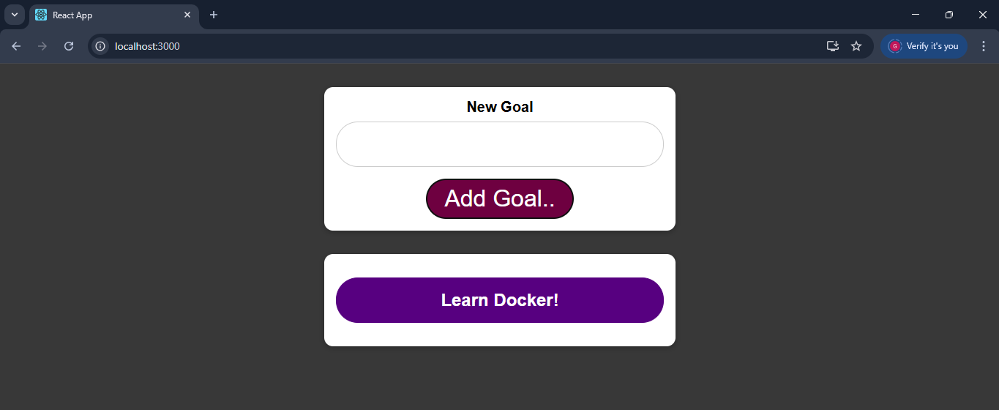

# 🚀 Docker Multi-Container Goal Tracking Application

A full-stack **goal tracking web application** built using a **multi-container Docker architecture**.  
This project demonstrates containerization, service orchestration, and persistent storage using Docker Compose.

----------------------------------------------------------------------------------------

## 📸 Application Preview



----------------------------------------------------------------------------------------

## 🏗️ Architecture

This application consists of three services:

- 🟣 **Frontend (React)** – User interface (Port 3000)  
- 🟢 **Backend (Node.js / Express)** – API layer (Port 80)  
- 🟡 **MongoDB** – NoSQL database for storing goals  

All services are managed using Docker Compose and communicate over a shared network.

----------------------------------------------------------------------------------------

## ⚙️ Features

- ✅ Add and view goals  
- ✅ Persistent data storage using MongoDB  
- ✅ Multi-container architecture  
- ✅ Live development using bind mounts  
- ✅ Environment-based configuration  

----------------------------------------------------------------------------------------

## 🐳 Tech Stack

- Docker  
- Docker Compose  
- Node.js (Express)  
- React  
- MongoDB  

----------------------------------------------------------------------------------------

## 📂 Project Structure

.
├── backend/ # Node.js API
├── frontend/ # React UI
├── env/ # Environment variable files
├── docker-compose.yml # Multi-container setup
├── screenshots/ # Application screenshots

----------------------------------------------------------------------------------------

## 🚀 Getting Started

1️⃣ Clone the Repository
```bash
git clone https://github.com/godugurahul14/Docker-multi-container-project.git
cd Docker-multi-container-project

2️⃣ Run the Application
docker-compose up --build
----------------------------------------------------------------------------------------
🌐 Access the Application
Frontend → http://localhost:3000
Backend → http://localhost:80
----------------------------------------------------------------------------------------
🔧 Docker Configuration Highlights
Multi-service orchestration using Docker Compose
Persistent storage using Docker volumes
Bind mounts for real-time development
Environment variables managed through external files
Service dependency handling (backend → MongoDB)
----------------------------------------------------------------------------------------
📦 Volumes
Volume Name	Purpose
goalsdata	MongoDB data persistence
logs	Backend logs
----------------------------------------------------------------------------------------
🔐 Environment Variables
Stored in:
env/backend_env
env/mongo_env
----------------------------------------------------------------------------------------
🧠 Key Learnings
Multi-container application design
Container networking and communication
Data persistence using volumes
Debugging containerized applications
Managing development vs container environments
----------------------------------------------------------------------------------------
🚀 Future Enhancements
Add Nginx reverse proxy
Implement health checks & restart policies
Add CI/CD pipeline (GitHub Actions)
Introduce authentication (JWT)
Deploy to cloud (AWS / Kubernetes)
